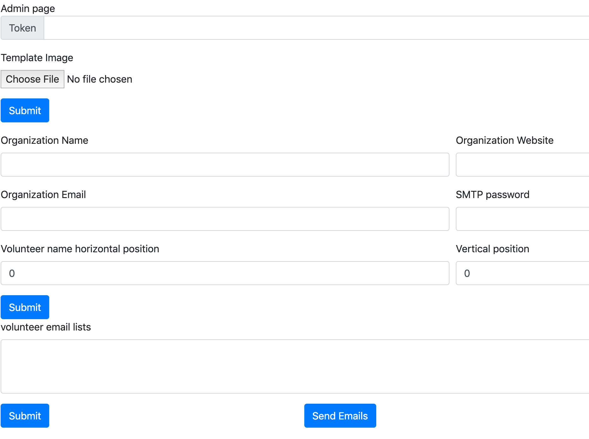
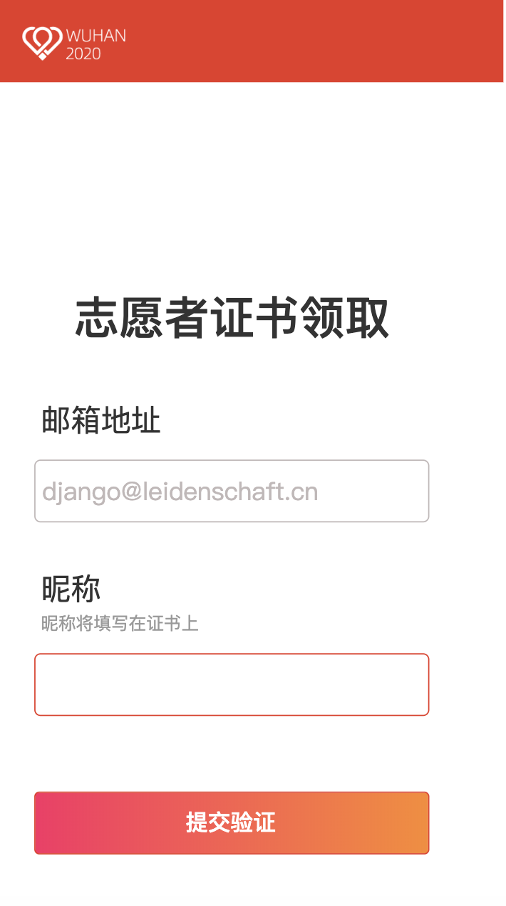
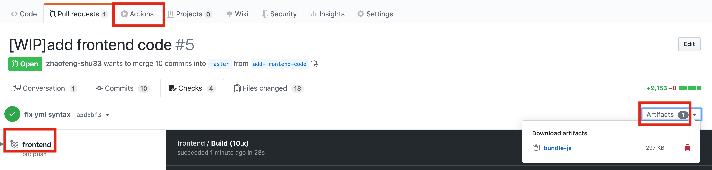

# certificate frontend
## How to use after deployment
As an activity organizer, you obtain the admin url and token from web administrator (try 1234, which is the default token if you do not have it). Then you can open the admin url using your desktop browser, which has the following form: `[somewhat]/admin.html`. Then you see the following page:



Firstly, please fill in the `Token` in the input box.
There are three `submit` buttons. Each one controls submission of different contents.
The first one is the submission of template pictures. Only `.jpg` extension is allowed.
The second submit button is the submission of some configuration information. You can leave
the one empty if you do not want to fill in anything. The most important part is to enter the correct coordinate of the name within the picture. You can calculate this coordinate
from some external desktop graphical software. The third submit button is for the volunteer emails. Fill in the textarea above the emails, one by each line without any punctuation.
The email you filled in this part is used to send the notification and certification to the volunteers. An important notice is that the password is SMTP password, not the password you used to login into your web email. To obtain the SMTP password, you can search the method online with the keyword "QQ mail enable SMTP" or something similar.

You can fill in your own personal email first in the textarea to test the functionality.
After all three submit button has been clicked and you have sucessfully submitted the information.

You can start send emails to the volunteers. Click the `Send Email` button and you are done.

You can add multiple emails in the textarea. Each email per line.
You can even add certificate numbers after the email using the following format:
```
email1,number1
email2,number2
```
When volunteers receive your notification email, they open a link in the email:



When they fill in their real name and they can receive another email which contains their certificate which their name on it.

## How to build
```shell
npm install
echo "export const API_URL = 'http://localhost:5000/';" > config-local.js
npm run build
```

## How to modify stylesheet without local environment
For designers, it is difficult for them to have a local build environment.
Actually designers can update `index.css` and submit a pull request to this repository.
Then he should download a file called `bundle.js` from the GitHub Action build artifacts
and put it under `dist` directory. Then he should start a local
server serving files under the dist directory. For example, using `python -m http.server` or other static file servers
when he is at this directory. Finally he can open his browser to see the changes brought by css.


