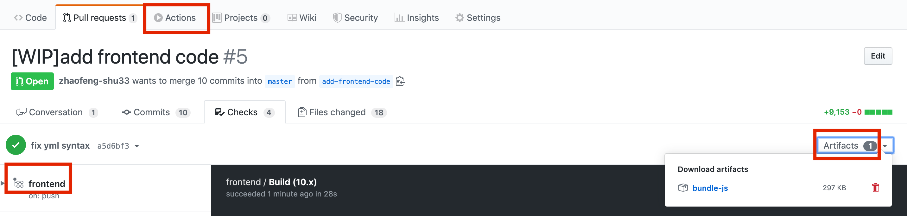

# certificate frontend
## How to build
```shell
npm install
echo "export const API_URL = 'http://localhost:5000/';" > config-local.js
npm run build
```

## How to modify stylesheet without local environment
For designers, it is difficult for them to have a local build environment.
Actually designers can update `index.css` and submit a pull request to this repository.
Then he should download a file called `bundle.js` from the GitHub Action build artifacts
and put it under `dist` directory. Then he should start a local
server serving files under the dist directory. For example, using `python -m http.server` or other static file servers
when he is at this directory. Finally he can open his browser to see the changes brought by css.

